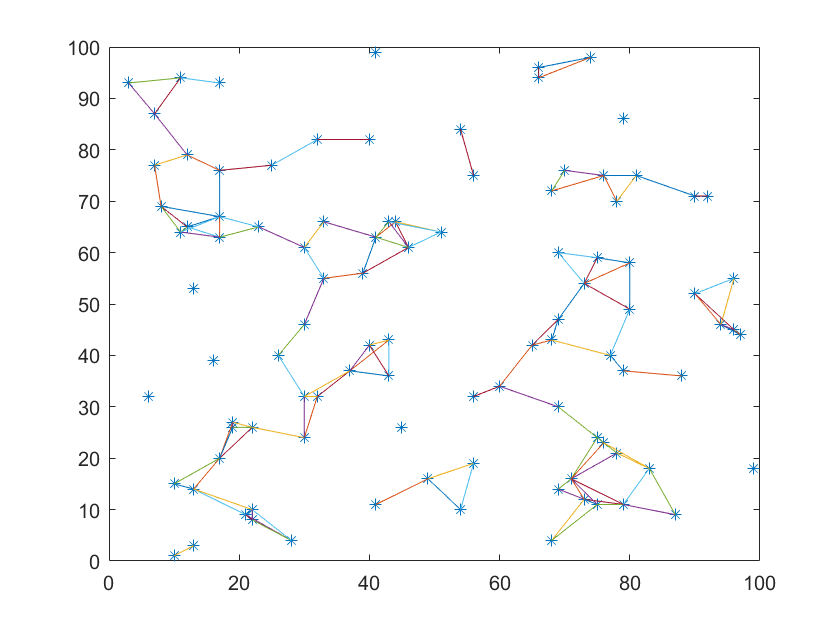
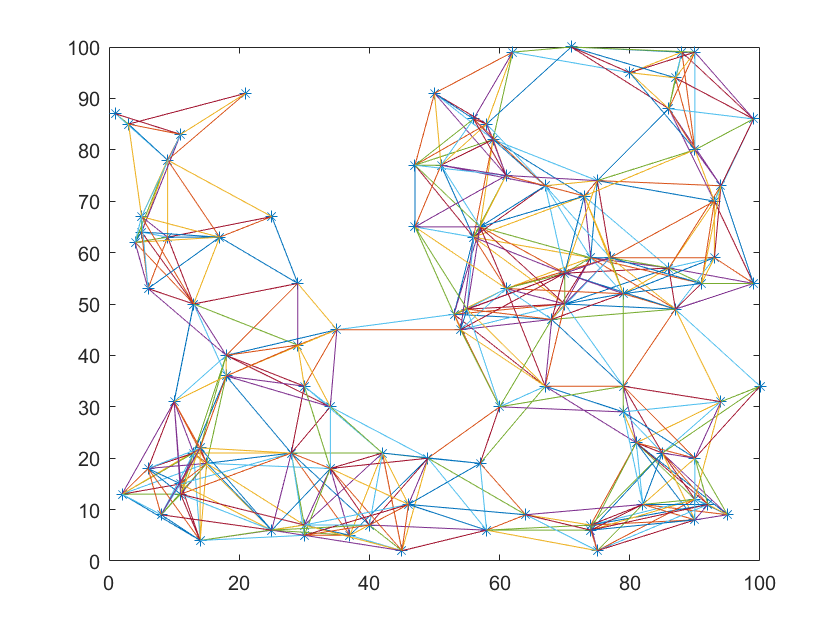
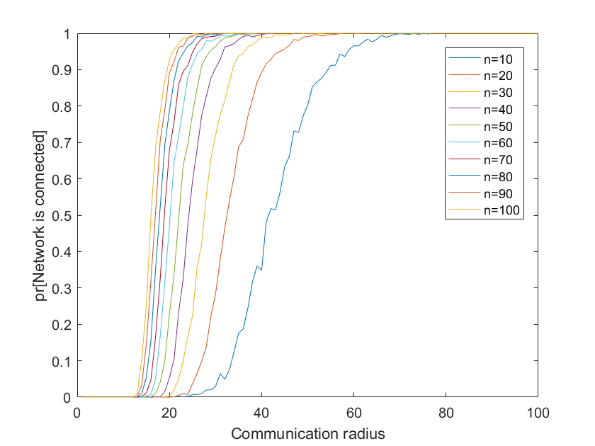
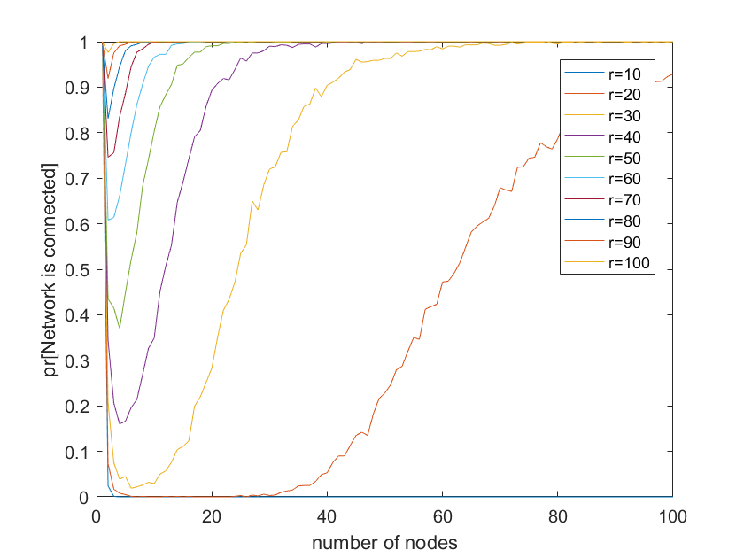

Connectivity in geometric random graphys
==
* Use function ***creatRandomNode()*** to creat random nodes in a 100*100 area.
* Use function ***checkLinks()*** to check whether two nodes can communicate with each other in a single-hop topology. The single procession is shown below:
  
	 
* Use function ***DFS()*** to check connected graph. This function based on Depth-First Traversa.
* Make 1000 trials, then show the results in the following graphys:
  
	 